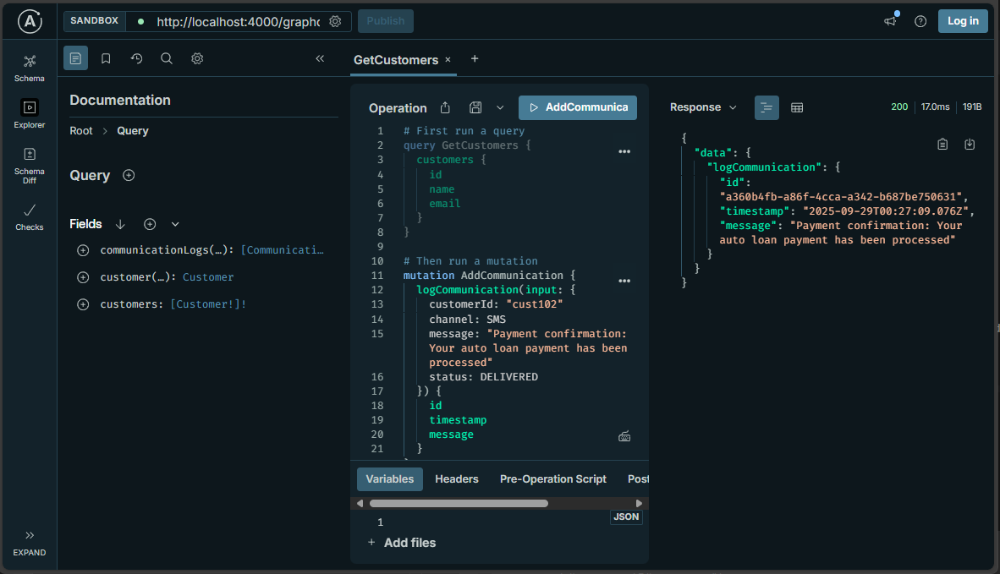

# 🚗 Automotive Customer Communication Hub GraphQL API

A **GraphQL API** built with Nod## 🖼️ Application Screenshots

### GraphQL Query Execution


*Customer data retrieval with nested communication logs*

### GraphQL Mutation Operations


*Adding new customer communications*

### Combined Query & Mutation Workflow


*Full CRUD operations demonstration*, and Apollo Server for managing automotive financial services customer communication history and preferences.


## 🚀 Overview

Enterprise-grade GraphQL API demonstrating scalable communication services architecture for automotive financial services. Features comprehensive schema design, nested resolvers, and real-time data management capabilities that simulate integration with CRM and communication platforms.

## 📋 Features

### 🎯 **GraphQL Operations**
- Comprehensive query system for customer and communication data retrieval
- Mutation operations for logging communications and status updates
- Nested relationship resolvers between customers and communication logs
- Flexible filtering by customer ID, communication channel, and status

### 🏗️ **Architecture Features**
- TypeScript for enhanced type safety and developer experience
- Apollo Server integration with Express middleware
- Mock data simulation of microservices architecture
- RESTful patterns adapted for GraphQL paradigms

### 💼 **Business Logic**
- Automotive financial services context (loan statements, payment reminders)
- Multi-channel communication support (Email, SMS, Call, App Notifications)
- Status tracking throughout communication lifecycle
- Customer preference management

## 🏃‍♂️ Quick Start

```bash
# Clone and install
git clone https://github.com/RitaJind/auto-comm-hub-graphql.git
cd auto-comm-hub-graphql
npm install

# Start development server
npm start
# Open http://localhost:4000/graphql
```

## 🏗️ Tech Stack

- **Backend**: Node.js 18+, TypeScript 5+
- **GraphQL**: Apollo Server 4+, GraphQL 16+
- **Web Framework**: Express.js
- **Development**: ts-node, UUID generation
- **Type Safety**: Full TypeScript implementation

## 🚀 Getting Started

### Prerequisites

- Node.js (v16+ recommended)
- npm or yarn

### Installation

1. Clone the repository:
   ```bash
   git clone https://github.com/RitaJind/auto-comm-hub-graphql.git
   cd auto-comm-hub-graphql
   ```

2. Install dependencies:
   ```bash
   npm install
   ```

3. Start the development server:
   ```bash
   npm start
   ```

4. Open GraphQL Playground at: `http://localhost:4000/graphql`

### Available Scripts

- `npm start` - Start the development server with ts-node
- `npm run build` - Build the TypeScript project
- `npm run serve` - Run the built JavaScript version
- `npm run dev` - Start with file watching for development

## �️ Application Screenshots

### GraphQL Query Execution


*Customer data retrieval with nested communication logs*

### GraphQL Mutation Operations


*Adding new customer communications*

### Combined Query & Mutation Workflow


*Full CRUD operations demonstration*

## 📁 Project Structure

```text
auto-comm-hub-graphql/
├── src/
│   ├── index.ts          # Apollo Server setup with Express
│   ├── schema.ts         # GraphQL type definitions
│   ├── resolvers.ts      # Query & mutation resolvers
│   ├── types.ts          # TypeScript interfaces
│   └── mockData.ts       # In-memory data simulation
├── images/               # Application screenshots
├── package.json          # Dependencies and scripts
├── tsconfig.json         # TypeScript configuration
└── README.md            # Project documentation
```

## 🚧 Development Status

### ✅ **Completed**
- GraphQL schema design with comprehensive type system
- Query resolvers for customer and communication data
- Mutation operations for CRUD functionality
- Nested relationship resolvers
- TypeScript implementation with full type safety
- Apollo Server integration with Express middleware

### 🔄 **Planned Enhancements**
- Database integration (PostgreSQL/MongoDB)
- Authentication and authorization middleware
- Real-time subscriptions for communication updates
- Performance optimization with DataLoader
- API rate limiting and caching strategies

## �📋 GraphQL Schema

### Types

- **Customer**: User profiles with communication preferences
- **CommunicationLog**: Record of all customer interactions
- **CommunicationChannel**: EMAIL, SMS, CALL, APP_NOTIFICATION
- **CommunicationStatus**: SENT, DELIVERED, READ, FAILED, CLICKED

### Sample Queries

```graphql
# Get all customers
query {
  customers {
    id
    name
    email
    communicationPreference
  }
}

# Get customer with communication logs
query {
  customer(id: "cust101") {
    name
    communicationLogs {
      id
      channel
      message
      status
      timestamp
    }
  }
}

# Filter communication logs
query {
  communicationLogs(customerId: "cust101", channel: EMAIL) {
    id
    subject
    message
    status
  }
}
```

### Sample Mutations

```graphql
# Log new communication
mutation {
  logCommunication(input: {
    customerId: "cust101"
    channel: EMAIL
    subject: "Payment Reminder"
    message: "Your payment is due tomorrow"
    status: SENT
  }) {
    id
    timestamp
    status
  }
}

# Update communication status
mutation {
  updateCommunicationStatus(input: {
    id: "log001"
    status: READ
  }) {
    id
    status
  }
}
```

## 🏗 Project Structure

```
auto-comm-hub-graphql/
├── src/
│   ├── index.ts          # Main server entry point
│   ├── schema.ts         # GraphQL schema definitions
│   ├── resolvers.ts      # GraphQL resolvers
│   ├── types.ts          # TypeScript interfaces
│   └── mockData.ts       # In-memory mock data
├── package.json
├── tsconfig.json
└── README.md
```

## 🎯 Business Value & Technical Impact

### **Automotive Financial Services Integration**
This GraphQL API demonstrates enterprise-level solutions for automotive financial services:

- **Unified Communication Hub**: Aggregates multiple communication channels (Email, SMS, App Notifications) through a single GraphQL endpoint
- **CRM Integration Ready**: Schema designed to integrate with existing customer relationship management systems
- **Microservices Architecture**: GraphQL acts as an API Gateway, perfect for modern distributed systems
- **Financial Context**: Real-world scenarios including loan statements, payment reminders, and promotional offers

### **GraphQL Best Practices Demonstrated**
- Complex nested queries with relationship resolvers
- Efficient data fetching patterns
- Type-safe mutations for data manipulation
- Schema-first development approach
- Modern Apollo Server integration patterns

---

## 👨‍� About the Developer

**Rita Jindal** - Full Stack Developer

*Passionate about building scalable, secure, and maintainable software solutions. Experienced in GraphQL API development, microservices architecture, and automotive financial services technology solutions.*

## 📄 License

MIT License - see LICENSE file for details